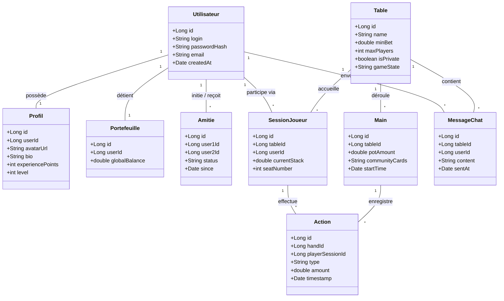
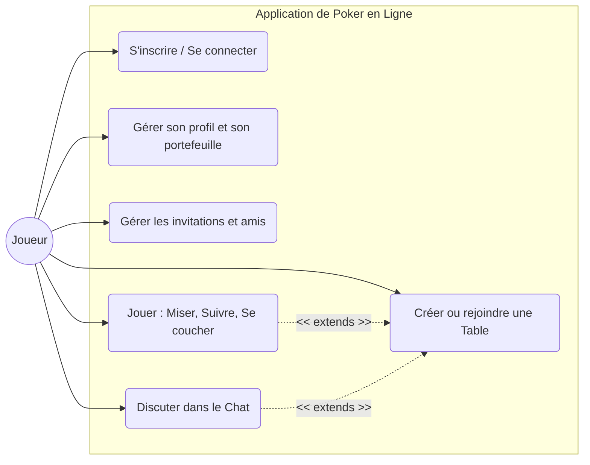

# Architecture du Système (9 Entités)

L'application respecte la contrainte d'avoir **plus de 7 entités** et suit une architecture **MVC** avec un back-end **SpringBoot**.

## 1. Bloc Persistant (Base de Données Relationnelle)
Ce bloc assure le stockage à long terme des informations utilisateurs.
* **Utilisateur :** Gère l'authentification (Login, mot de passe haché, email).
* **Profil :** Contient les données sociales (Avatar, biographie, niveau d'expérience).
* **Portefeuille :** Gère le capital global de jetons pour le **classement**.
* **Amitié :** Gère les relations et les **invitations entre joueurs**.

## 2. Bloc de Jeu (Gestion en mémoire / Temps réel)
Pour garantir le **temps réel** et la **performance**, ces classes gèrent l'état actif des parties :
* **Table :** Définit l'espace de jeu (Nom, mise minimale, places disponibles).
* **SessionJoueur :** Entité pivot permettant à un joueur d'être sur **plusieurs tables simultanément**.
* **Main (Hand) :** Représente un tour de jeu.
* **Action :** Enregistre chaque mouvement (Mise, fold, check) pour la logique de jeu.
* **MessageChat :** Gère les flux de communication du **Chat**.

## Architecture Java
```
src/
 ├── main/
 │    ├── java/com/projet/poker/
 │    │    ├── PokerApplication.java          # Point d'entrée SpringBoot
 │    │    ├── model/                         # Entités (JPA @Entity ou simples POJOs)
 │    │    │    ├── persist/                  # Utilisateur, Profil, Portefeuille, Amitie
 │    │    │    └── game/                     # Table, SessionJoueur, Main, Action (État en mémoire)
 │    │    ├── repository/                    # Interfaces Spring Data JPA (UtilisateurRepository...)
 │    │    ├── service/                       # Les "Facades" contenant la logique métier (UserService, GameService)
 │    │    ├── controller/                    # Les Servlets ou @RestController (gèrent les requêtes HTTP/WebSockets)
 │    │    ├── dto/                           # Data Transfer Objects (Pour ne pas renvoyer directement les Entités JPA à la vue)
 │    │    ├── config/                        # Configuration Spring (WebSockets, Sécurité, BDD)
 │    │    └── engine/                        # Moteur du jeu de Poker (PUREMENT Java : règles, calcul des mains. Indépendant de Spring)
 │    │
 │    ├── resources/
 │    │    ├── application.properties         # Config BDD, port Tomcat, etc.
 │    │    └── static/                        # Fichiers CSS, JS, Images (si utilisation de JSP/HTML classique)
 │    │
 │    └── webapp/
 │         └── WEB-INF/
 │              └── jsp/                      # Vues JSP
 └── pom.xml                                  # Dépendances (Spring Web, Spring Data JPA, H2/MySQL, WebSockets)
```

## Diagramme de classe 


## Diagramme d'usage

